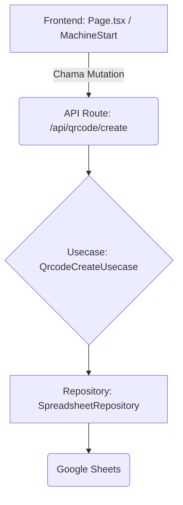

# 🏭 Apontamento de Produção CNC (Scan & Go)

Uma aplicação moderna e reativa, construída com Next.js e TanStack Query, para digitalizar e simplificar o processo de apontamento de início e fim de produção em máquinas CNC através da leitura de QR Codes.

## 🚀 Como Funciona (O Fluxo do Operador)

1.  **Scan & Load:** O operador escaneia o QR Code na Ordem de Produção (OP).
2.  **Identificação:** O sistema identifica a máquina e os dados da OP/ITEM via URL.
3.  **Status Check:** O app verifica o status da máquina:
    - **Máquina Livre:** Exibe o formulário de **INÍCIO** (seleção de operador e status).
    - **Produção em Andamento:** Exibe a tela de **ACOMPANHAMENTO** com cronômetro em tempo real, permitindo **Finalizar** ou **Pausar** a produção.
4.  **Persistência:** Todos os apontamentos são registrados em tempo real em uma Google Sheet configurada.

## 🧱 Stack de Desenvolvimento

| Área              | Tecnologia            | Motivo/Uso no Projeto                                                  |
| :---------------- | :-------------------- | :--------------------------------------------------------------------- |
| **Frontend**      | Next.js (App Router)  | Roteamento dinâmico e renderização híbrida.                            |
| **UI/UX**         | Tailwind CSS          | Estilização rápida e mobile-first.                                     |
| **Estado/Cache**  | TanStack Query        | Gerenciamento de dados assíncronos e _refetch_ automático.             |
| **Formulários**   | React Hook Form & Zod | Validação de schema robusta e controle de formulários não-controlados. |
| **Backend/Dados** | Next.js API Routes    | Camada de _backend_ para receber requisições e persistir dados.        |
| **Persistência**  | Google Sheets         | Banco de dados simples e acessível (via `spreadsheet-repository.ts`).  |
| **Linguagem**     | TypeScript            | Garantia de segurança e tipagem em todas as camadas.                   |

## 📐 Arquitetura: Clean & Isolada

O projeto foi desenhado com uma arquitetura de camadas para garantir a separação de preocupações e facilitar a troca de banco de dados (ex: de Google Sheet para PostgreSQL) sem afetar a lógica de negócio.



| Camada           | Objetivo                                                                                                 |
| :--------------- | :------------------------------------------------------------------------------------------------------- |
| **Usecases**     | Contém **a lógica de negócio pura** (Ex: `qrcode-update-usecase.ts`).                                    |
| **Repositories** | Contém a **lógica de acesso a dados** (Ex: `spreadsheet-repository.ts` manipula o `google-spreadsheet`). |
| **API Routes**   | Conecta o frontend com o Usecase, realizando a **Injeção de Dependência** do Repository.                 |

## ⚙️ Configuração e Instalação

### 1\. Pré-requisitos

- Node.js (v18+)
- Google Sheets API (Service Account Credentials)

### 2\. Passos Iniciais

```bash
# 1. Clone o projeto
git clone [URL_DO_SEU_REPOSITORIO]
cd apontamento-producao

# 2. Instale as dependências
npm install
# ou
yarn install
```

### 3\. Configuração do Google Sheets

Crie um arquivo `.env.local` na raiz do projeto com as suas credenciais para acesso à planilha.

```env
# ID da Google Sheet onde os apontamentos serão salvos.
GOOGLE_SHEET_ID="SEU_ID_DA_PLANILHA_AQUI"

# Credenciais do Service Account (JSON em uma única linha)
# Geração via Google Cloud Console
GOOGLE_CREDENTIALS='{ ... seu JSON de credenciais ... }'
```

### 4\. Execução

Inicie o servidor de desenvolvimento:

```bash
npm run dev
# ou
yarn dev
```

Acesse o aplicativo em `http://localhost:3000`.

**🔗 Para Simular a Leitura do QR Code:**
Use a seguinte estrutura de URL no seu navegador:

```
http://localhost:3000/apontamento/MAQUINA_01?op=12345&item=98765
```

## 🤝 Contribuição

Sua contribuição é muito bem-vinda\! Se você tem uma sugestão, encontrou um bug ou quer adicionar um recurso:

1.  Faça um Fork do projeto.
2.  Crie uma nova _branch_ (`git checkout -b feature/nome-da-feature`).
3.  Faça o Commit das suas alterações (`git commit -m 'feat: Adiciona cronômetro de pausa'`).
4.  Envie para o branch (`git push origin feature/nome-da-feature`).
5.  Abra um **Pull Request**.
